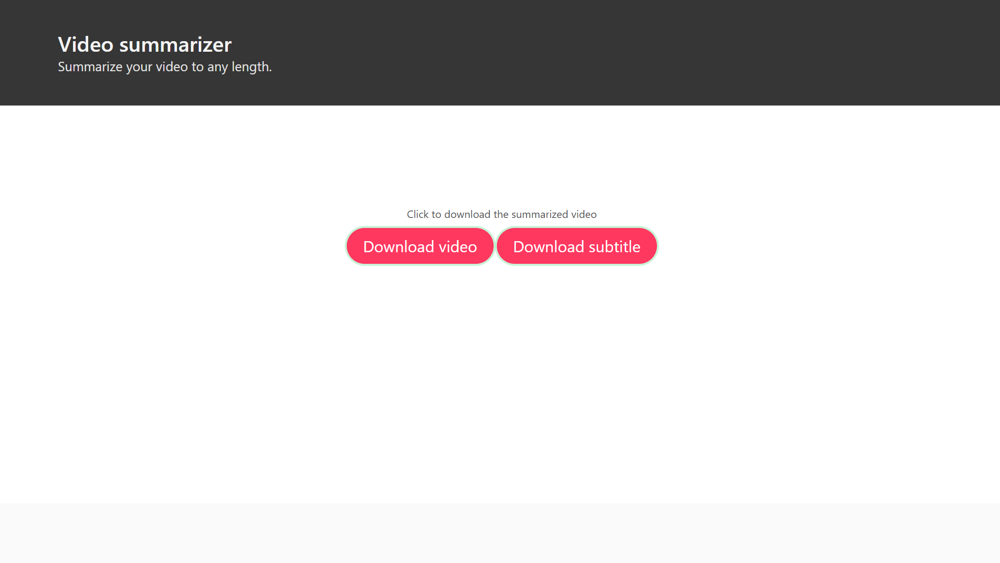

<br>

# What it does?

Summideo is a video summarizer where in you can upload any video from local system to summarize it into any duration which you provide as input. Summarization is done using NLP algorithms which is used to analyze the subtitles of the video to extract the important parts. 

# Features
- Can summarize video to any duration 
- Does speech recognition to Generate videos wit
- Has 5 NLP algorithms for summarization.
- Can combine any 5 NLP algorithms for summarization.
- Easy to use

# How to fire it up? 

- Gotta install the requirements first

``` pip3 install -r requirements.txt```

- Now run the server

```python3 manage.py runserver```

- The web app is up and running on [localhost:8000](https://localhost:8000/)

# How to use 
- Upload a video file
- Upload the corresponding subtitle file
- Click on download button to download the summarized video

# Screenshots





